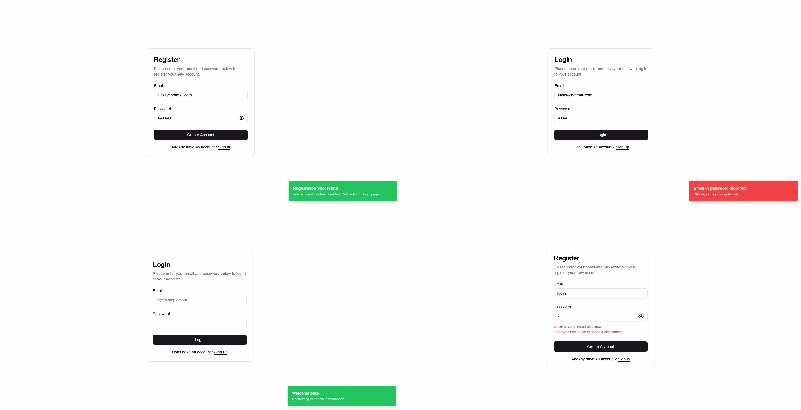

# Authentication Form

This is a free authentication form for login/register using: **Next.js, Prisma, Shadcn, React Hook Form, Auth.js and Zod**.




### Ambient Configuration


1. Open a terminal and clone the repository:
```bash
git clone https://github.com/lucasroqe/auth-form.git
```
2. Create and adjust a .env file with the database credentials. In this case, I'm using SQLite.
```bash
DATABASE_URL="file:./dev.db"  # or replace with your database URL
```
3. Install the project dependencies:
```sh
npm i
```
4. Run the Prisma migration:
```sh
npx prisma migrate dev
```
5. Generate the auth secret key:
```sh
npx auth secret
```
